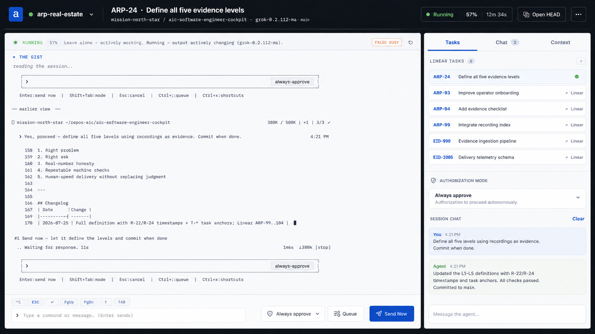

# Target UX — session head (Linear + side chats)

**Status:** design target (mockup), not yet fully implemented.  
**Source mockup:** [images/target-ux-sidechats-linear.png](images/target-ux-sidechats-linear.png)  
**Captured:** 2026-07-27 (ChatGPT design exploration for emux session head)

This is the north-star layout for **opening a single live session**: full head on the left, a structured **work drawer** on the right. It unifies three things we already partially built (gist, Linear keys, side chat) into one operator-grade panel.

---

## Layout (what the mockup shows)

### 1. Session chrome (top bar)

| Element | Intent |
|---------|--------|
| Live pill + session name | Identity of the seat (`arp-real-estate`) |
| **Primary Linear issue as title** | `ARP-24 · Define all five evidence levels` — the *active work item*, not only the session name |
| Branch / repo / model | Context strip: `mission-north-star / aic-software-engineer-cockpit · grok-…` |
| Running % + elapsed | At-a-glance liveness (not only “live / gone”) |
| **Open HEAD** | Explicit attach action (iTerm / real terminal) kept first-class |
| Overflow `…` | Secondary actions without clutter |

### 2. Left: the head (terminal + operator rail)

| Zone | Intent |
|------|--------|
| **Status banner** | Classifier-style summary: *Leave alone — actively working…* plus honesty badges (`FALSE BUSY`) |
| **THE GIST** | Reader’s digest of the session (we already have this) |
| **Live pane** | Scrollable terminal book (history + live); this remains the truth surface |
| **Key chips** | `^C` ESC ↑ PgUp/PgDn TAB — transport keys stay one click away |
| **Composer row** | Typed command/message + **authorization mode** + **Queue** + **Send Now** |

Composer notes from the mockup that matter:

- **Always approve / authorization mode** is *visible per session*, not buried in settings.
- **Queue vs Send Now** separates “nudge when safe” from “interrupt now” — aligns with send-is-transport doctrine.
- Prompt placeholder is calm: *Type a command or message…*

### 3. Right drawer — three tabs

This is the big product move: **one drawer, three modes of talking to work**.

#### Tab A — **Tasks** (Linear inventory)

- Section label: **LINEAR TASKS (N)**
- Each row: issue key + title + status pip or “↗ Linear”
- Active issue highlighted (e.g. ARP-24 with green pip)
- Rows are not just links — they are **work handles** (open Linear, open side chat, load/pursue)

#### Tab B — **Chat** (session side chat, badge = open threads)

- Full conversation log with the operator and the agent (or a side-thread)
- Distinct from raw pane scrollback — this is the *human briefing channel*
- Clear + composer: *Message the agent…*
- Badge count on the tab = how many side-chat threads exist for this session

#### Tab C — **Context**

- Reserved in the mockup for durable context (cwd, registry tags, Linear acceptance, manages edges, last classifier, etc.)
- Not fully drawn — leave as a third pillar so Tasks and Chat don’t absorb everything

### 4. Authorization block (inside drawer)

A dedicated **Authorization mode** card under Tasks:

- e.g. *Always approve — Authorization to proceed autonomously*
- Makes Hancock / gate policy *readable on the seat*, not only when a gate fires

---

## Principles encoded by the mockup

1. **Session ≠ work item.** Session name is the seat; Linear issue is the job. Both must be visible.
2. **Terminal stays center stage.** The drawer never replaces the pane; it *orients* you.
3. **Tasks are first-class inventory**, extracted from the conversation (regex / registry), not a separate app.
4. **Chat is plural.** The tab badge implies many side chats; the default “reply to session” is only one of them.
5. **Pursue is one click.** Selecting a task should load enough context that the agent can *own* next steps.
6. **Honesty about state.** “FALSE BUSY”, running %, classifier banner — operators need truth, not a green spinner.
7. **Send is still transport.** Queue / Send Now / always-approve are about *when* keys land, not a second product.

---

## Gap map (mockup vs emux today)

| Mockup | Today (≈0.68.13) | Gap |
|--------|------------------|-----|
| Primary Linear issue in header title | Session name only | Promote active `TEAM-123` into modal title when known |
| Running % + elapsed | live / hist tags | Surface classifier + wall-clock work duration |
| Status banner (“Leave alone…”) | judge strip + gist | Merge into one calm banner |
| Tasks / Chat / **Context** tabs | Tasks drawer + floating multi side-chats | **Dock Chat into the drawer tabs**; add Context tab |
| Linear list with titles | Keys only (regex) | Optional title hydrate (Linear API/MCP later); keys stay offline-first |
| Session Chat log in drawer | Floating stack of side chats | Keep multi-chat; **embed list + active thread in Chat tab** |
| Authorization mode card | settings / Hancock | Per-session auth mode control in drawer |
| Queue vs Send Now | single SEND | Explicit queue vs immediate send |
| Open HEAD | OPEN HEAD exists | Keep; match placement |

Implementation should **converge** floating side chats + Tasks drawer into this tabbed right rail, not invent a third panel system.

---

## Acceptance (when this UX is “done”)

1. Opening any session shows **left head + right Tasks/Chat/Context** without hunting for floaters.
2. Every `TEAM-123` in the pane is linkified; **💬** loads/pursues that issue (side chat + parent prompt).
3. Tasks tab lists all issues mentioned; active issue is obvious in the header.
4. Chat tab shows **N** side threads for this session; operator can open more without leaving the head.
5. Composer always shows current authorization mode; Queue and Send Now are distinct.
6. Desktop-first still holds; drawer collapses on narrow widths without losing Tasks access.

---

## Non-goals (still)

- Full Linear project board inside emux (emux inventories *this seat’s* issues, not the whole org).
- Replacing Hancock for irreversible gates.
- Mobile-first redesign of the whole control room.

---

## Related

- [north-star.md](north-star.md) — product job of emux web  
- [vocabulary.md](vocabulary.md) — Sessions / Heads / CHATS  
- Live code: session modal + Tasks drawer + multi side-chats + Linear linkify (emux ≥ 0.68.12)
